# Linux Troubleshooting
## Problems

### 🚨 The Latency of my application has increased!
```
$ top
```
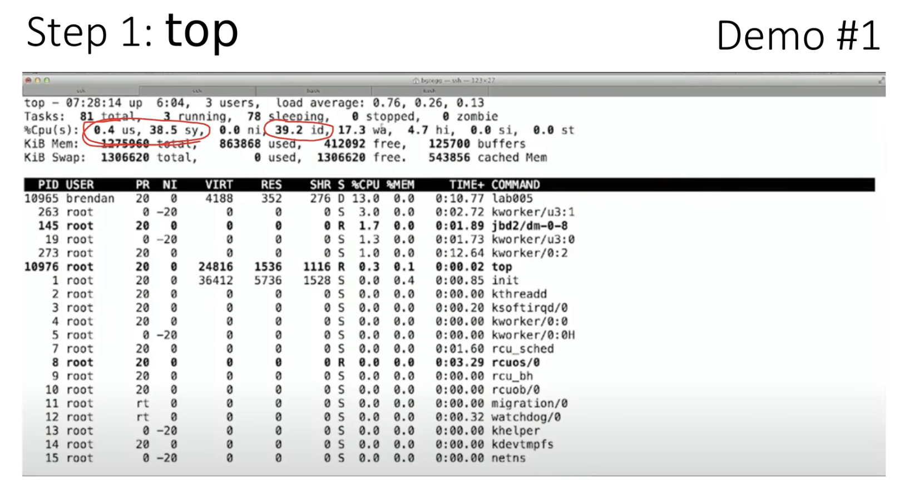
⚡️ Tip: `0.4%` going to user space, `38.5%` on system space, `39.2%` idle

```
$ vmstat 1
```
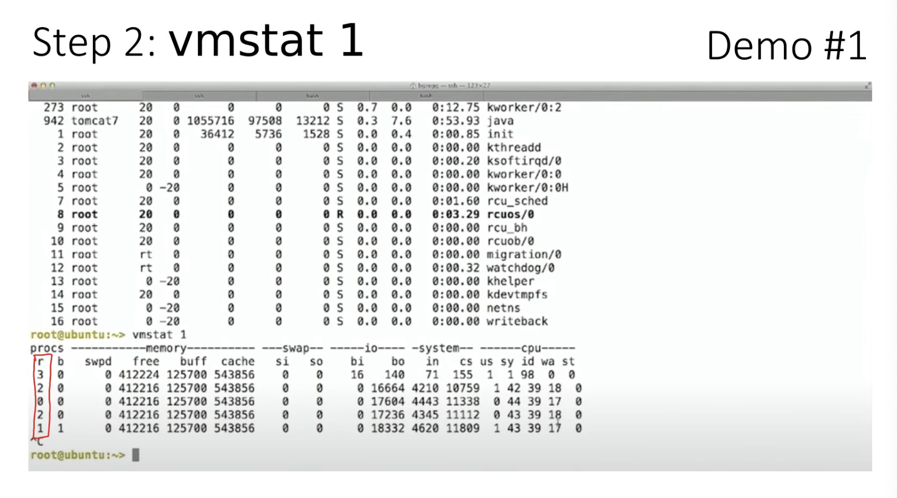
⚡️ Tip: if the `r` values is greather than the value of CPU cores, the cpu is saturated.
⚡️ Tip: if swap is used it indicates that the system doesnt have enough memory.
⚡️ Tip: `us` = user time, `sys` = system time, `id` = idle, `wa` = waitio
⚡️ Tip: Significant amount of `wa` and `id` means there's alot of disk waiting time which also causing the cpu to idle.

```
$ mpstat -P ALL 1
```
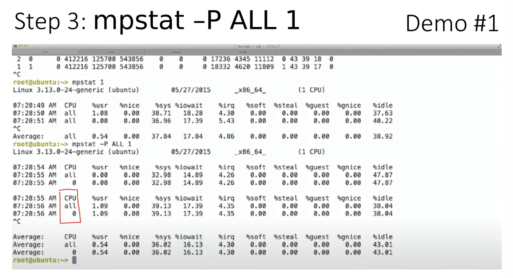
⚡️ Tip: Single hot CPU indicates that an single-threaded application is running.

```
$ iostat -x 1
```
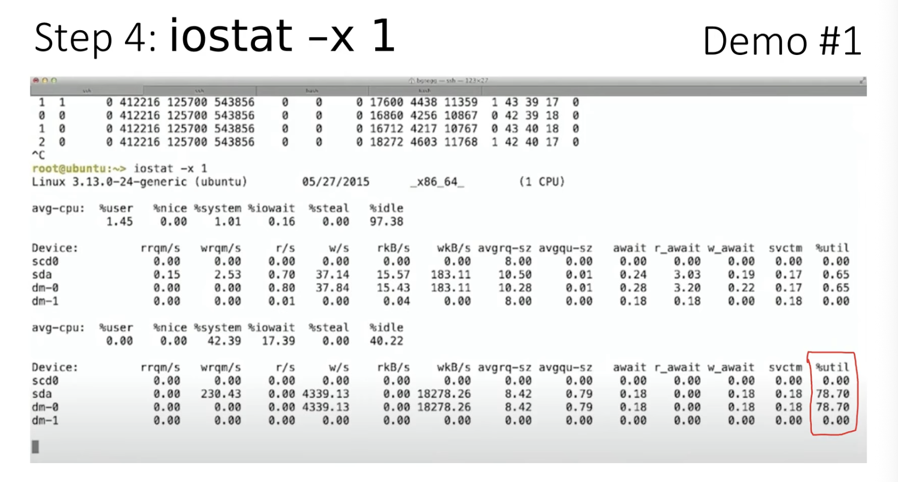
⚡️ Tip: `%util` shows significant amount of disk utilization, `<60%` util typically lead to poor performance. Unlike CPU, system can run generally well with max CPU, kernels understand priority and can run through threads, this is not true for disk, its harder to send IO with high priority dispatch if already doing something else (however, not relavant to SSD).

```
$ sar -n DEV 1
```
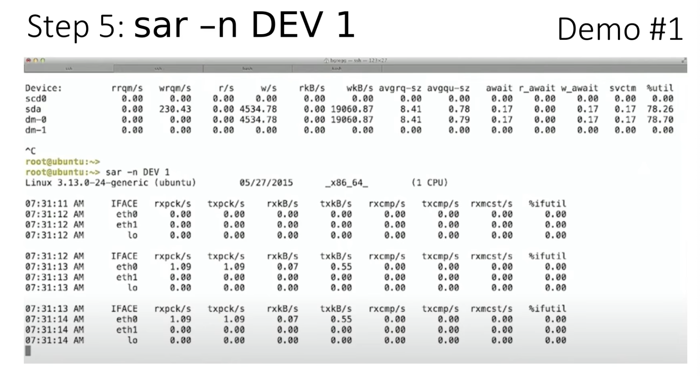

**💡 Findings: Disk high utilization causing performance issue.**
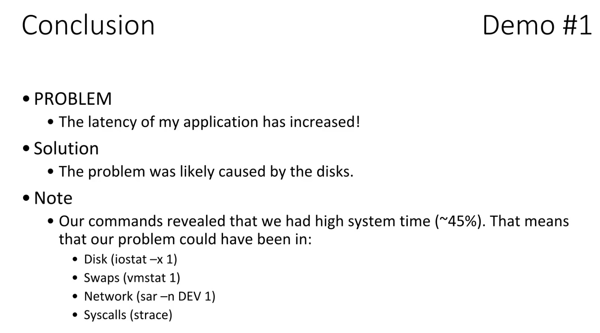

---

### 🚨 The application is taking forever...
```
$ vmstat 1
```
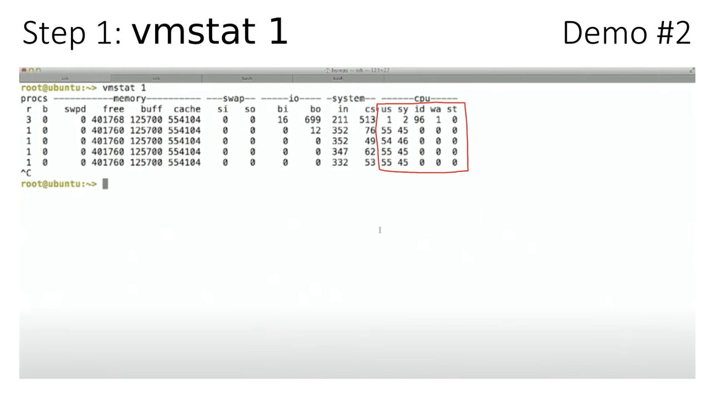
⚡️ Tip: there is no idle time, around `40%` system time, `50%` user time.

```
$ mpstat 1
```
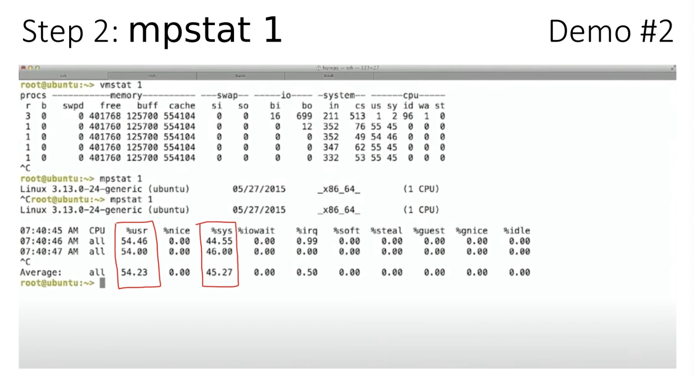
⚡️ Tip: Pretty much the same information, nothing to report.

```
$ pidstat 1
```
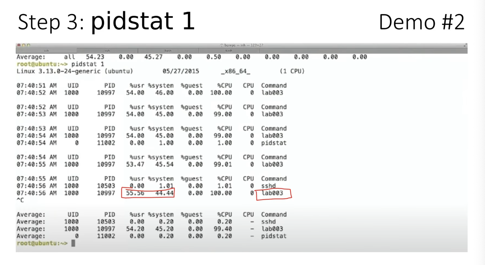
⚡️ Tip: `lab003` app shows using the significant amount of cpu.

```
$ iostat -x 1
```
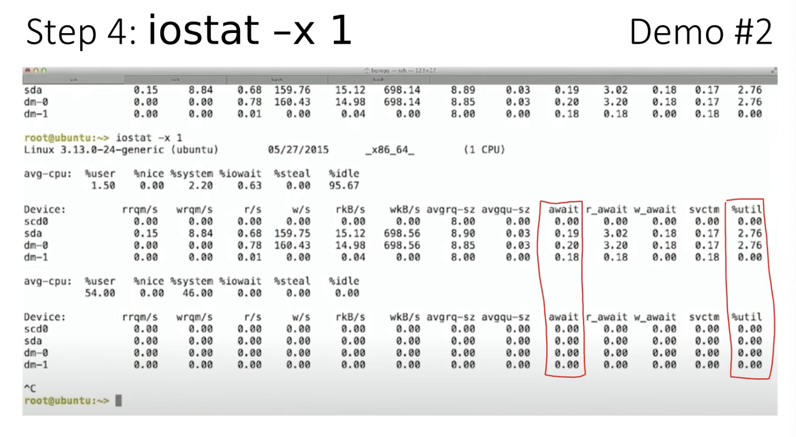
⚡️ Tip: `2-3%` utilization is ok and await is also in ms, nothing to report.

```
$ sar -n DEV 1
```
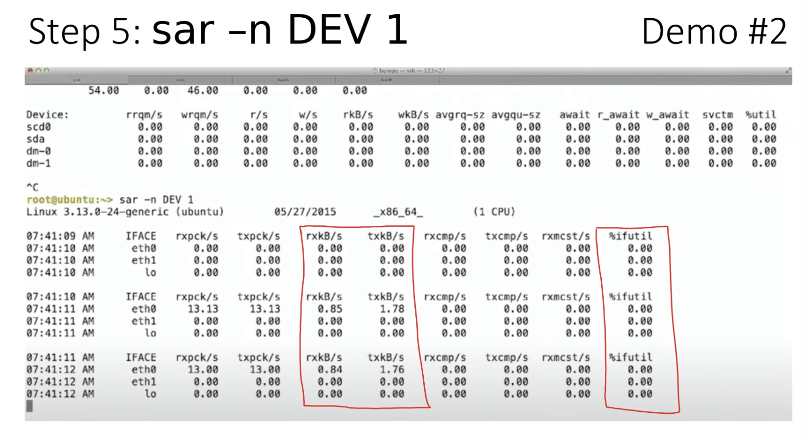
⚡️ Tip: Low utilization, nothing to report.

```
$ strace -tp `pgrep lab003` 2>&1 | head -100
```
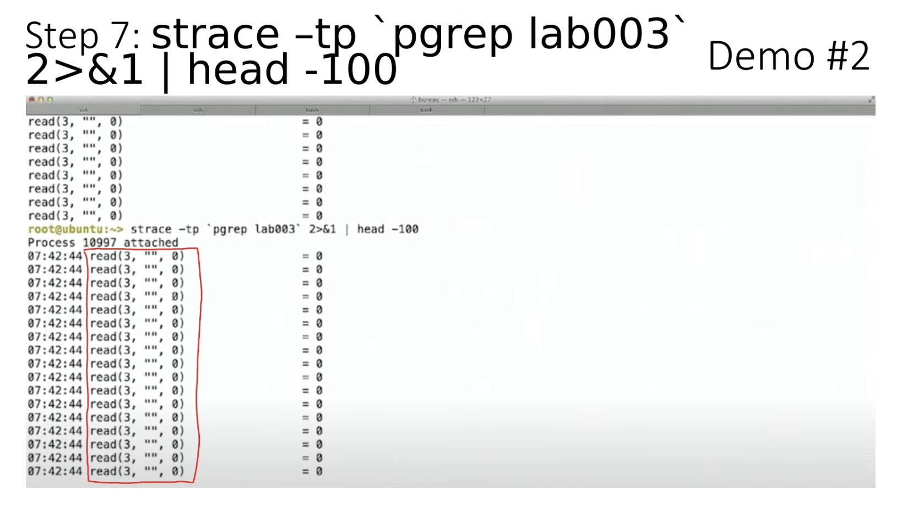
⚡️ Tip: Trace shows, system call `read` is beign called in file descriptor `3`, and requesting `0` amount of bytes each time.

**💡 Findings: Then application is running a never ending loop trying to read a file.**
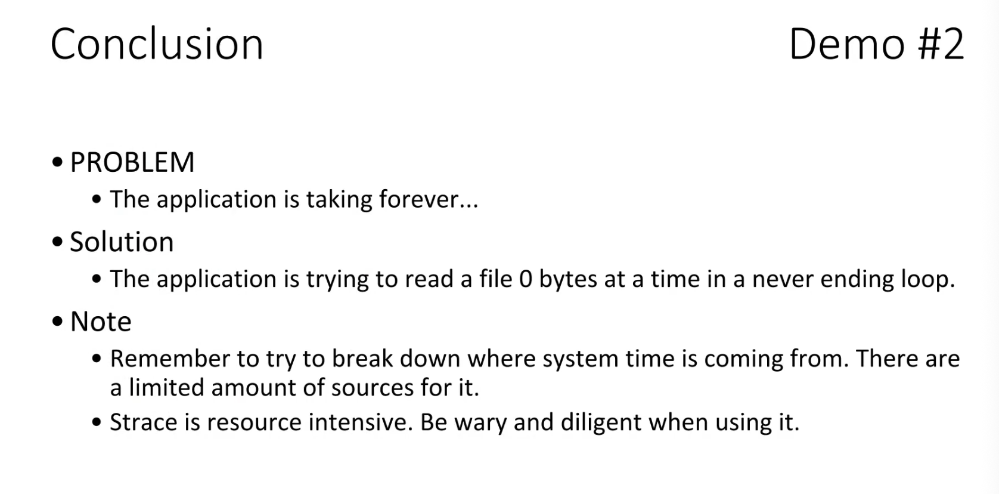

---

### 🚨 Something mysterious is consuming the CPU.
```
$ top
```
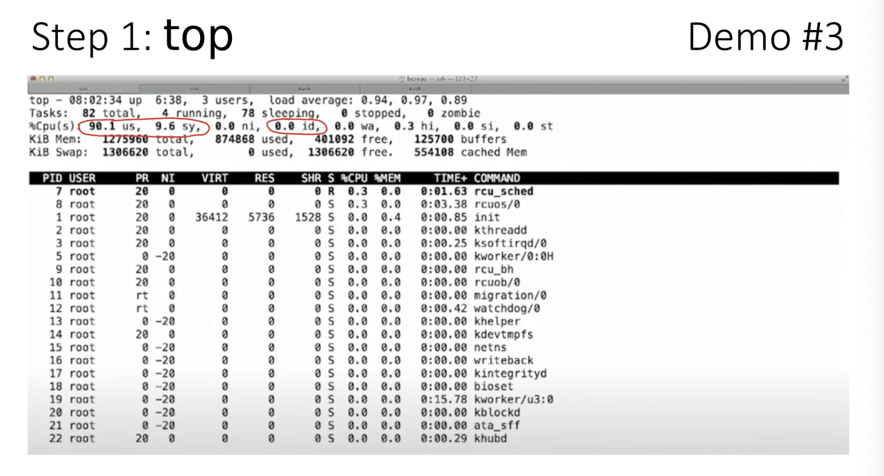
⚡️ Tip: `90%` user time, `9.6%` systemtime, `0.0` idle, but top `%CPU` not showing what causing the CPU saturation. Normally it would appear in `%CPU` column.

```
$ mpstat 1
```
⚡️ Tip: Same behaviour. No additional information what cuased it, nothing to report.
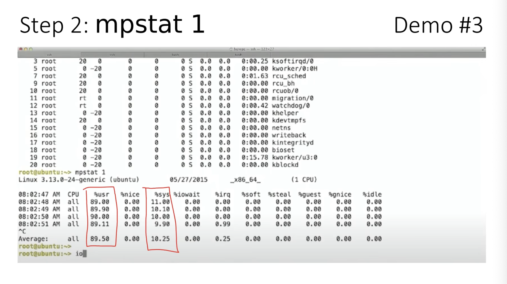

```
$ iostat -x 1
```
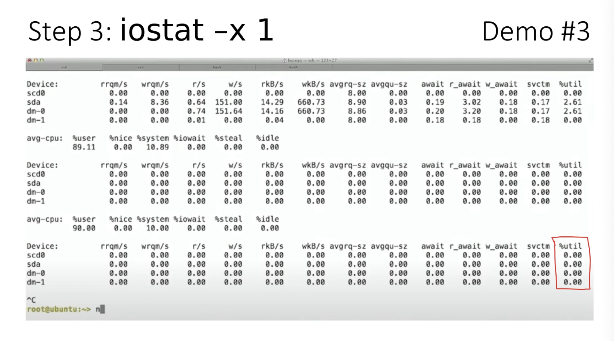
⚡️ Tip: Nothing to report.

```
$ sar -n DEV 1
```
⚡️ Tip: Nothing to report.

```
$ vmstat 1
```
⚡️ Tip: Nothing to report, has enough amount of memory no swapping going on.

```
$ perf record -F 99 -a -g -- sleep 10
```
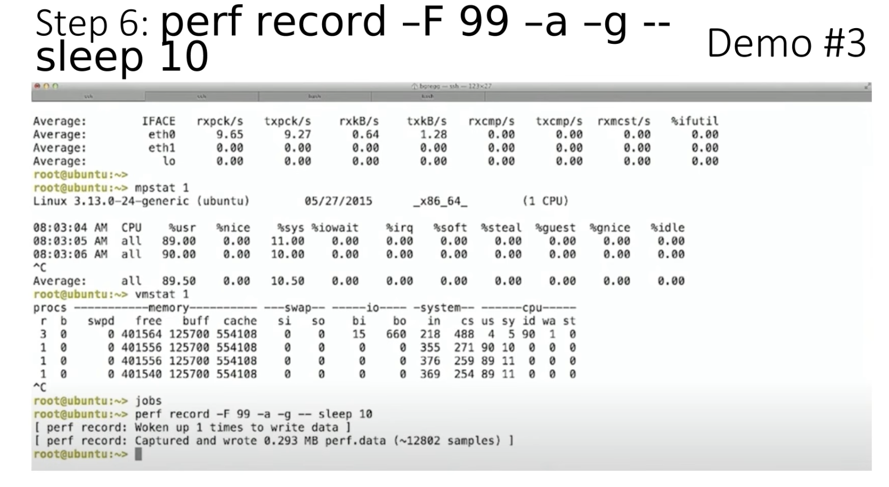
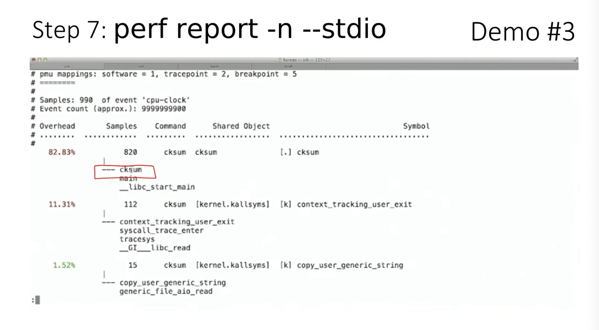
⚡️ Tip: perf running `99 hertz` for all CPU call graph for `10s`. `99 hertz` instead of `100` to avoid recording activity running in specific intervals.
⚡️ Tip: It's not showing in Top because its a short-live processes.

**Finding: It's caused by short-live process where top cannot catch, profiling with perf catched it.**
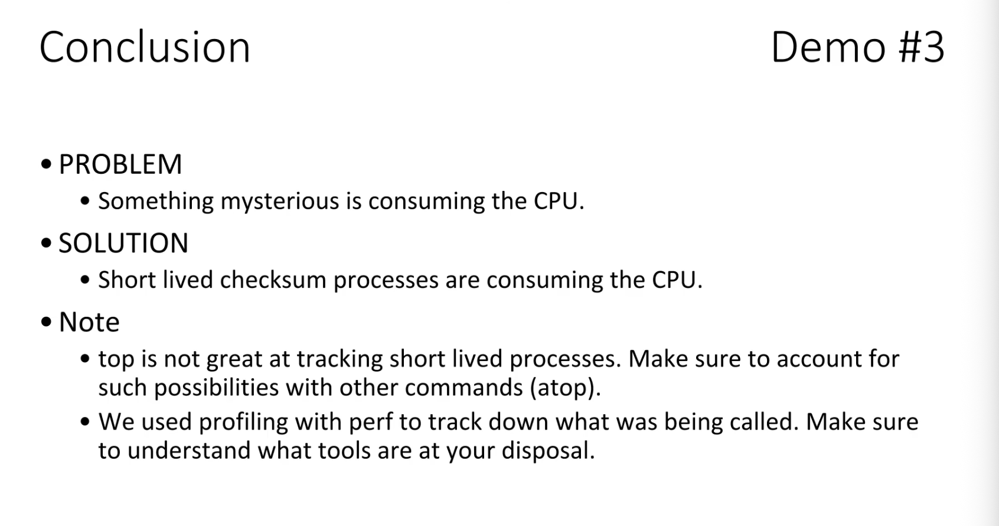